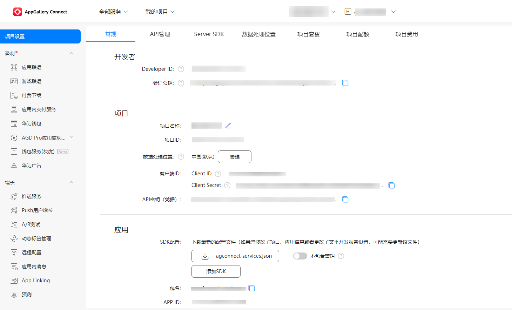
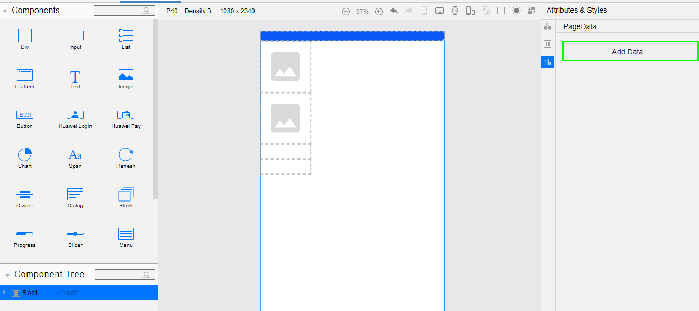
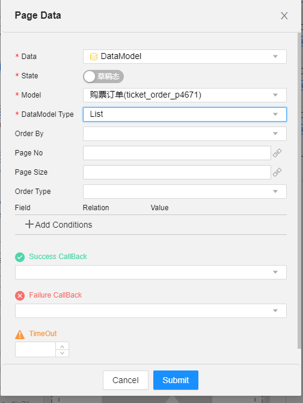

# 如何使用此模板

## 准备开发环境

1. 安装HUAWEI DevEco
   Studio，使用DevEco打开此项目, [HUAWEI DevEco Studio使用指导](https://developer.harmonyos.com/cn/docs/documentation/doc-guides/tools_overview-0000001053582387)。
2. 访问AGC页面时推荐使用谷歌浏览器。如果使用win10系统的火狐浏览器，可能出现请求被浏览器拦截，导致点击下载无响应的问题。
   处理方法：
   在火狐浏览器地址栏输入about:config。
   查找security.csp.enable，将其切换为 false。
3. 在[华为开发者联盟](https://developer.huawei.com/consumer/cn)
   上注册成为开发者并完成实名认证，具体方法可参考[帐号注册认证](https://developer.huawei.com/consumer/cn/doc/start/registration-and-verification-0000001053628148)。


## 工程配置

Serverless低代码开发平台是一个可视化的平台， 打通了HarmonyOS云侧与端侧能力，能够轻松实现HMS Core、AGC Serverless能力调用。其中，数据模型和连接器是两大主要元素。开发者在使用DevEco Studio的低代码功能进行开发时，可以使用其可视化、傻瓜式的操作配置构建HarmonyOS原子化服务、PC Web应用，助力原助力原子化服务快速开发与降本增效子化服务快速开发与降本增效。
```
该功能在DevEco Studio 3.1 Beta2DevEco Studio 3.1 Release及更高版本中支持，且创建的工程必须是compileSdkVersion为6的JS工程。
```
登录[AppGallery Connect云控制台](https://developer.huawei.com/consumer/cn/service/josp/agc/index.html#/)创建自己的目标项目，并创建一个目标应用。
项目是您在AGC资源的组织实体，您可以将一个应用的不同平台版本添加到同一个项目中。如果您在使用AGC的服务时在AGC中还没有项目，则需要先创建项目，具体操作请参见[创建项目](https://developer.huawei.com/consumer/cn/doc/distribution/app/agc-help-createproject-0000001100334664)。
如果您还没有在您的AGC项目中添加应用，请先完成应用的添加，具体请参见[在项目下添加应用](https://developer.huawei.com/consumer/cn/doc/distribution/app/agc-help-createapp-0000001146718717#section1112105771619)。



在AppGallery Connect云控制台，点击‘项目设置’，下载agconnect-services.json文件，放置在工程的entry目录下。
```
本Demo中agconnect-services.json为空文件，请用您下载的agconnect-services.json进行替换
```
至此完成了开发低代码云端工程的初始化配置。

```
注意：DevEco中API6 JS 低代码工程，Bundle Name要和云控制台里创建应用时设置的包名一致，否则运行时会报错bundleName不一致。
本Demo中包名默认为com.huawei.scenicarea，您需要在创建完应用后全局替换掉此包名。
```

## 数据模型管理与使用
在AppGallery Connect云控制台创建数据模型以后，能够在DevEco Studio端使用定义好的数据模型。
管理数据模型在低代码平台数据模型界面，可以新建、修改、更新、删除数据模型及其详细信息。

使用数据模型
1. 在DevEco Studio中登录后，打开visual文件，对需要使用数据模型的控件，点击‘Add Data’。

2. 选择一个数据模型，点击submit，DevEco Studio会在同名的js文件中自动生成相应代码，您可以通过在控件上绑定data或者方法实现数据模型的增删改查。

3. Build项目，生成HAP，推送到真机或者模拟器上即可查看效果。

连接器管理与使用同样，在AppGallery Connect云控制台创建连接器以后，能够在DevEco Studio端使用定义好的连接器。


低代码开发相关可查看[此链接](https://developer.harmonyos.com/cn/docs/documentation/doc-guides/ide-low-code-0000001158284713#section117114015189)
